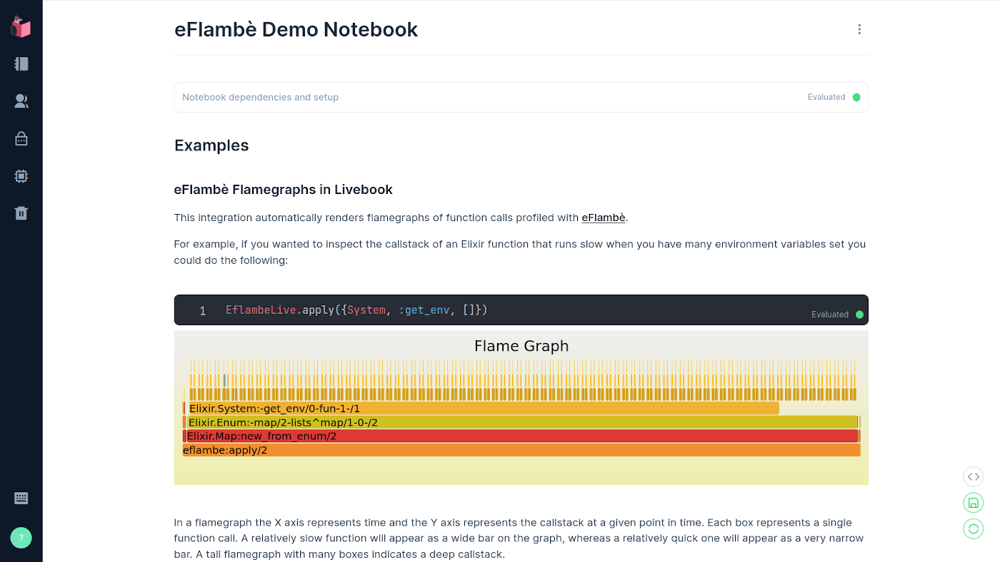

image::docs/eflambe-torch-logo.png[E flambè Live, a tool for rapid profiling of Elixir code in Livebook]

* Generate and view flamegraphs in livebook
* Uses link:https://github.com/Stratus3D/eflambe[eFlambè] to generate flamegraphs

== Screenshot and demo

The best way to see how it works is to link:guides/eflambe_live_demo.livemd[open up the demo in Livebook!]

== Description

eFlambè integration with Livebook. This tool is designed for rapid profiling of Elixir code in Livebook. The API mirrors the API profiled by `:eflambe` but the output is displayed as an interactive SVG flamegraph in Livebook using link:https://hexdocs.pm/kino/Kino.JS.html[Kino.JS].

== Installation

Add the following to the setup block in your livebook to use EflambeLive:

[source, elixir]
----
Mix.install([
  {:kino, "~> 0.7.0"},
  {:eflambe_live, "~> 0.1.0"}
])
----

== Usage

There are two ways to profile code with eflambè. You can either invoke the code directly using `EflambeLive.apply/1,2` or you can "capture" trace data from a function when it is invoked by another process on the node `EflambeLive.capture/1,2,3`.

== Implementation

For SpawnFest 2021 I created link:https://github.com/Stratus3D/eflambe[eFlambè]. This year I wanted to try extending it to Livebook. eFlambè worked well enough for its intended use, but there were several things that had to be addressed in order to use it from Livebook:

* eFlambè only wrote flamegraph data to files on disk. There was no API that returned flamegraphs to the caller.
* The `eflambe:capture/3` function was asynchronous so the flamegraph wasn't even generated when the function returned.
* eFlambè only generated flamegraphs in formats that required a link:https://www.speedscope.app/[flamegraph viewer] in order to understand.

I addressed these issues in a series of PRs:

* I redesigned the eFlambè API so function calls were synchronous and would return the name of the file containing the flamegraph data. **This PR was done before SpawnFest and is not part of my submission**: https://github.com/Stratus3D/eflambe/pull/34
* Added an option to return the formatted flamegraph data directly: https://github.com/Stratus3D/eflambe/pull/35
* Added an eFlambè link:https://github.com/Stratus3D/eflambe/blob/master/src/eflambe_output_formatter.erl[formatter] that generated a self-contained interactive SVG file: https://github.com/Stratus3D/eflambe/pull/36

With these things in place there was very little code that needed to be written for EflambeLive. The functions in `EflambeLive` call corresponding functions in `:eflambe` and receive SVG data back from them. The code passes the SVG data to `Kino.JS` which handles rendering the SVG on the page and adding JavaScript and CSS to make the SVG interactive in Livebook.

The JavaScript code that makes the flamegraph interactive was ported from https://github.com/brendangregg/FlameGraph.

This project was inspired by Mike Binn's https://github.com/DockYard/flame_on project and is very similar.

== Links

* Hex package: TODO
* Github: https://github.com/spawnfest/eflambe_live
* eFlambè: https://github.com/Stratus3D/eflambe
* JS ported from: https://github.com/brendangregg/FlameGraph

== Contributing

Feedback is welcome! This was started as a hackathon project but I plan on maintaining it for my teams every day use, so if you see something that could be improved please open an issue!

==== Tagging Releases

1. Update versions in `README.adoc` to new version.
1. Run `git add README.adoc`.
1. Use `mix hex.publish`.
1. Run `git tag <new tag>`.
1. Run `git push origin master <new tag>`.
